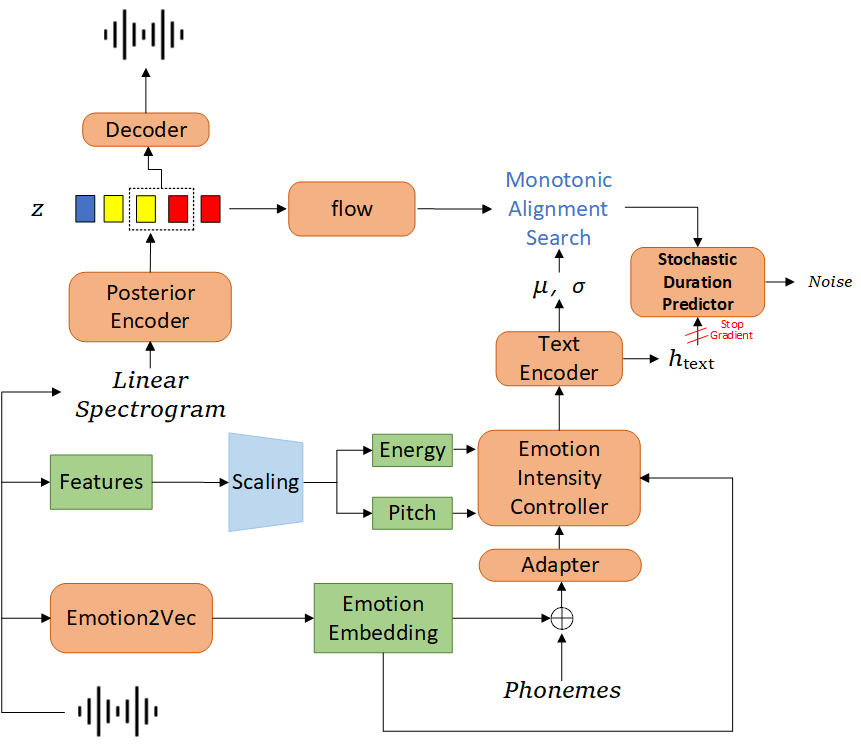

# Controllable Emotional Speech Synthesis via Emotion Transfer

## Abstract:

Synthesizing expressive speech based on reference audio style is a key area in emotional speech synthesis. While recent models can produce natural and clear speech, controlling emotional intensity remains a challenge. To address this, we propose a VITS-based TTS model with controllable emotional intensity. We incorporate a pre-trained Emotion2Vec model and design an emotion intensity controller. Emotional embeddings extracted from reference audio via Emo2Vec are fused with phoneme-level text features to enable emotion transfer. We hypothesize—and confirm through experiments—that emotional intensity correlates with pitch and energy. Therefore, we construct the emotional intensity control module around a pitch predictor and an energy predictor to enable global-level control over emotional strength.Experiments show that our model synthesizes speech with quality comparable to ground truth and enables controllable emotional intensity without degrading audio quality.

#### 1. The architecture of the proposed model:

#### 2. Demo of style transfer for emotional TTS :

> To facilitate fair comparison, we synthesis audios with four emotions using five models. 
> 
> |          |                                 |                                       |                                       |                                         |                                      |                                  |
| :------: | :-----------------------------: | :-----------------------------------: | :-----------------------------------: | :-------------------------------------: | :----------------------------------: | :------------------------------: |
|  emotion |         Reference audio         |           Target speaker           |              CME-TTS              |               ME-TTS              |       wav2vec2+VITS       |      ours w/o Intensity controller      |       wav2vec2+VIT       |
|   happy   |  |  |  |  |  |  |  |
|   angry   |  |  |  |  |  |  |  |
|    sad    |  |  |  |  |  |  |  |
|  surprise |  |  |  |  |  |  |  |

> 
> 

#### 3. Demo of emotion strength control in emotional TTS :

> To facilitate fair comparison, we use the same text to synthesize speech in four emotions and three strengths. This may let the listeners more focused on the emotion delivered in the acoustic aspects. The text is (in Chinese): 雨后的空气充斥着青草的味道
> 
> |          |                                                          |                                                   |                                                          |                                                   |                                                          |                                                   |
| :------: | :------------------------------------------------------: | :-----------------------------------------------: | :------------------------------------------------------: | :-----------------------------------------------: | :------------------------------------------------------: | :-----------------------------------------------: |
|  emotion |                     scale factor (Low)                    |                   proposed (Low)                  |                   scale factor (Medium)                   |                 proposed (Medium)                 |                   scale factor (Strong)                   |                 proposed (Strong)                 |
|   happy   |  |  |  |  |  |  |
|   angry   |     |  |     |  |     |  |
|    sad    |       |  |       |  |       |  |
|  surprise |     |  |     |  |     |  |
> 
> 

